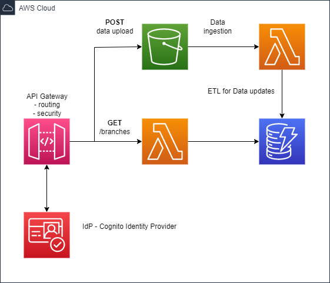

# Open Banking Demo

## Target Architecture




## Build and deploy

```bash
 mvn clean package
 sam deploy -g --region eu-west-2  --stack-name openbanking-demo-app
```

## Implementation Constraints

A very lean implementation with the following limitations:

1. Missing API security
2. No unit or functional test coverage.
3. 12-factor principle was not followed
   - Embedded and improvised data storage using a hash map
4. No schema or constraint validation on ingested data.
5. No application health check.
